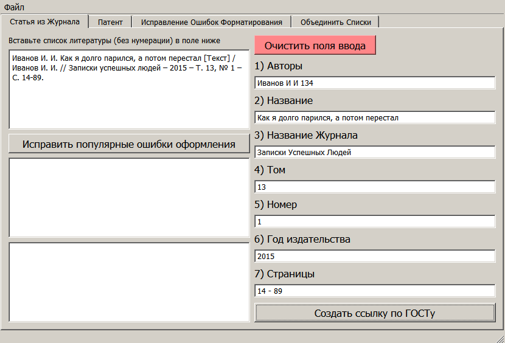
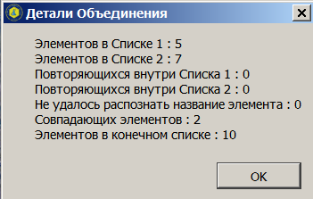
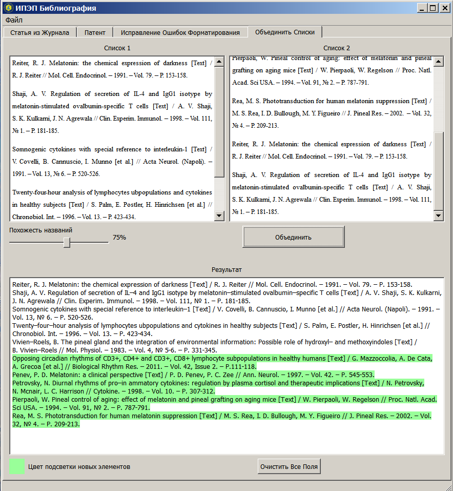

# GOST_Literature
Небольшое десктопное приложение для работы с ГОСТ-овскими списками литературы.

Приложение было создано (не весь функционал реализован) для облегчения жизни людям, которым необходимо работать с большим объемом библиографических ссылок, оформленных по ГОСТУ и не реализованных через функционал текстового редактора, т.е. ссылки вставленные вручную.

Из полезного функционала: 
1) Вставка сшивателей (не переносящихся пробелов и тире, чтобы не разрывать инициалы и фамилии, номера страниц и т.п.)
2) Сканирование списков на повторяющиеся ссылки
3) Объединение нескольких списков в один с выделением цветом новых ссылок
4) Создание ссылки на статью
5) Исправление популярных ошибок форматирования, которые часто допускаются при ручном оформлении

Как это выглядит:

